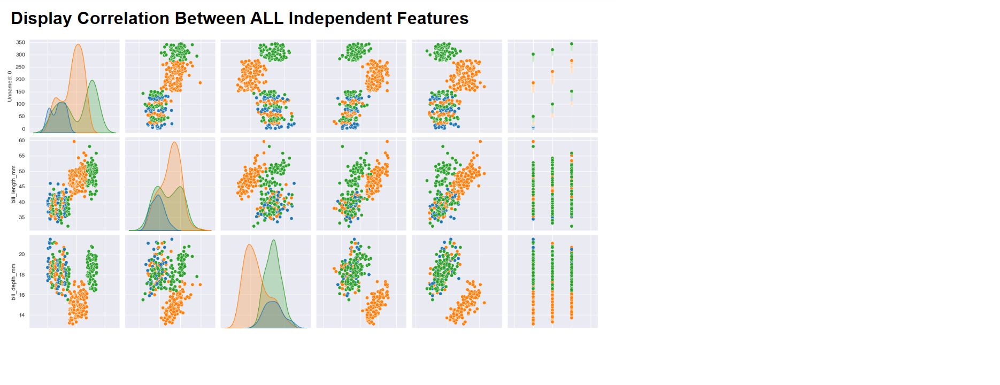
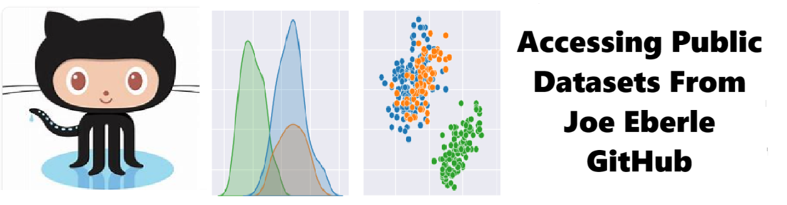

# Curated Datasets - Solution for Curated Datasets
Solution for Curated Datasets

Welcome to the solution **Curated Datasets** - an example for your projects

Solution for Curated Datasets
## instructions # Curated datasets  - Exploratory Data Analysis - Its EASY !!!   

## Welcome to the ** curated datasets ** repository! 
## This project demonstrates how to access data science data - EASILY  !!! 

## Consistent Curated Project Data is a critical time saver in data science -  EASILY  !!!  

## NOTE - THIS REPOSITORY WORK IN PROGRESS 

## There are many ways to do this. It isnt perfect !!! so Experiment. Branch it and Change it. Collaborate and HAVE FUN !!! 

## Features

- Pairs Correlations 
- Descriptive Staatistics
- creative and Fun !!

## Notebook Features

- Easily Configurable
- Low Code - or - No Code
- Educational 

## Getting Started

To get started with the **  Curated datasets ** project, follow these steps:

1. Clone the repository to your local machine.
2. Install the required dependencies listed at the top of the notebook.
3. Explore the example code provided in the repository and experiment.
4. Run the notebook and your find your most Critical Data - EASY !

 

## Features
- Easy to understand and use  
- Easily Configurable 
- Quickly start your project with pre-built templates
- Its Fast and Automated

## Notebook Features
- **Self Documenting** - Automatically identifes major steps in notebook 
- **Self Testing** - Unit Testing for each ptyhon function
- **Easily Configurable** -easily modifyable with config.INI name value pairs
- **Includes Talking Code** - The code explains itself.
- **Self Logging** - enhanced python standard logging   
- **Self Debugging** - enhanced python standard debugging
- **Low Code - or - No Code** - Most solutions are under 50 lines of code
- **Educational** - Includes educational dialogue and background material
    
## Getting Started
To get started with the **Curated Datasets** solution repository, follow these steps:
1. Clone the repository to your local machine.
2. Install the required dependencies listed at the top of the notebook.
3. Explore the example code provided in the repository and experiment.
4. Run the notebook and make it your own - **EASY !**
    
## https://github.com/JoeEberle/ -- josepheberle@outlook.com 
    

          